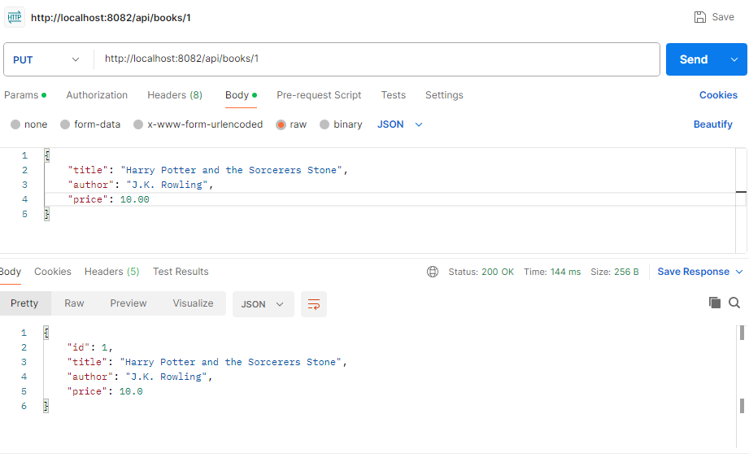
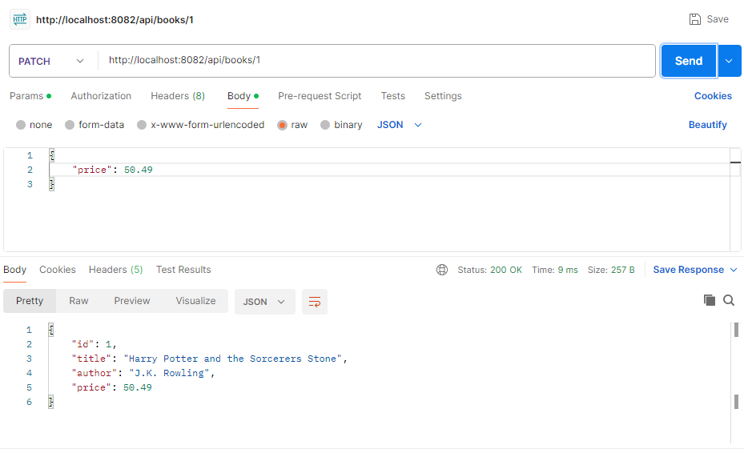
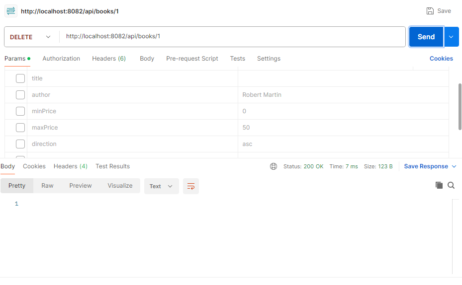
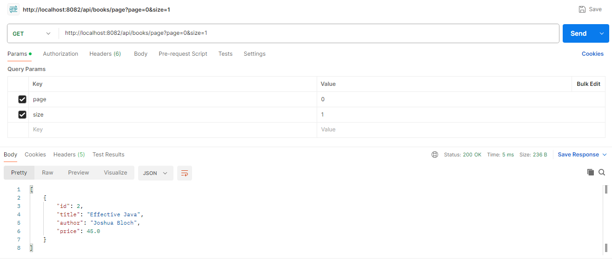
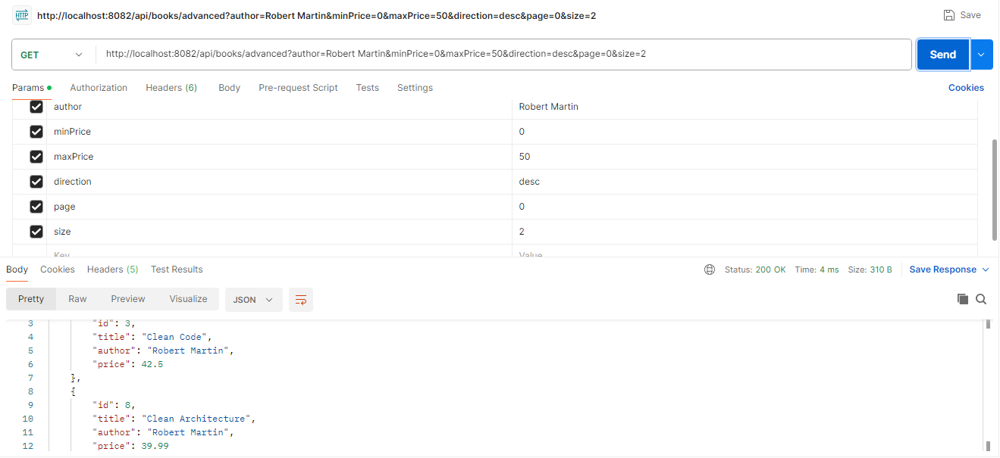

# Web Back End Homework 1
Extended the Book API built in class with
additional CRUD operations and advanced query features.
I added PUT endpoint, PATCH endpoint, DELETE endpoint, GET endpoint
with pagination, and advanced GET endpoint with
filtering, sorting, and pagination combined in valid order.

## PUT Endpoint
Updates all fields of book.

## PATCH Endpoint 
Updates only specified fields of book.

## DELETE Endpoint
Deletes specified book.

## GET Endpoint with Pagination
Retrieves books in chunks based on page and size.

## Advanced GET Endpoint with filtering, sorting, and pagination
Retrieves book matching criteria at a more specific level.

